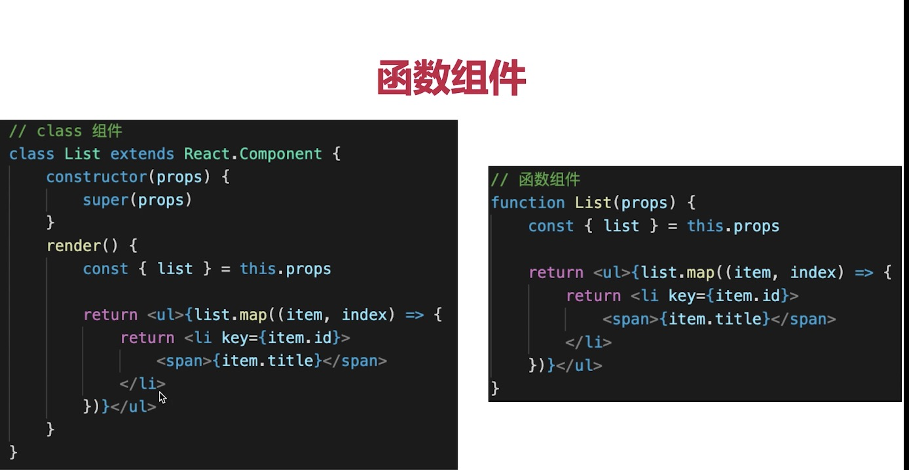

This project was bootstrapped with [Create React App](https://github.com/facebook/create-react-app).

## Available Scripts

In the project directory, you can run:

### `yarn start`

Runs the app in the development mode.<br />
Open [http://localhost:3000](http://localhost:3000) to view it in the browser.

The page will reload if you make edits.<br />
You will also see any lint errors in the console.

### `yarn test`

Launches the test runner in the interactive watch mode.<br />
See the section about [running tests](https://facebook.github.io/create-react-app/docs/running-tests) for more information.

### `yarn build`

Builds the app for production to the `build` folder.<br />
It correctly bundles React in production mode and optimizes the build for the best performance.

The build is minified and the filenames include the hashes.<br />
Your app is ready to be deployed!

See the section about [deployment](https://facebook.github.io/create-react-app/docs/deployment) for more information.

### `yarn eject`

**Note: this is a one-way operation. Once you `eject`, you can’t go back!**

If you aren’t satisfied with the build tool and configuration choices, you can `eject` at any time. This command will remove the single build dependency from your project.

Instead, it will copy all the configuration files and the transitive dependencies (webpack, Babel, ESLint, etc) right into your project so you have full control over them. All of the commands except `eject` will still work, but they will point to the copied scripts so you can tweak them. At this point you’re on your own.

You don’t have to ever use `eject`. The curated feature set is suitable for small and middle deployments, and you shouldn’t feel obligated to use this feature. However we understand that this tool wouldn’t be useful if you couldn’t customize it when you are ready for it.

## Learn More

You can learn more in the [Create React App documentation](https://facebook.github.io/create-react-app/docs/getting-started).

To learn React, check out the [React documentation](https://reactjs.org/).

### Code Splitting

This section has moved here: https://facebook.github.io/create-react-app/docs/code-splitting

### Analyzing the Bundle Size

This section has moved here: https://facebook.github.io/create-react-app/docs/analyzing-the-bundle-size

### Making a Progressive Web App

This section has moved here: https://facebook.github.io/create-react-app/docs/making-a-progressive-web-app

### Advanced Configuration

This section has moved here: https://facebook.github.io/create-react-app/docs/advanced-configuration

### Deployment

This section has moved here: https://facebook.github.io/create-react-app/docs/deployment

### `yarn build` fails to minify

This section has moved here: https://facebook.github.io/create-react-app/docs/troubleshooting#npm-run-build-fails-to-minify

### npm管理和node版本管理
* npm升级npm install -g npm,升级npm到最新版本
* n stable，升级node到最新稳定版本

### 在create-react-app中使用mobx
* 参考链接(在create-react-app中使用mobx)[https://blog.csdn.net/tianxintiandisheng/article/details/103667463]
* 在chrome中调试快捷键是option+command+i

### 创建项目及mobx在项目中的初步使用
* npm install -g create-react-app
* create-react-app dnet
* cd dnet
* 先提交代码到git,然后yarn eject
* yarn add @babel/plugin-proposal-decorators --save-dev
* 在package.json中修改babel的配置为
```$xslt
"babel": {
    "presets": [
      "react-app"
    ],
    "plugins": [
      ["@babel/plugin-proposal-decorators", { "legacy": true }]
      ]
  },
```
* yarn add mobx --save
* yarn add mobx-react --save
* 最后yarn一下，安装yarn eject之后的依赖
* 新建store文件夹，新建test.js文件，新增代码
```$xslt
import {observable, action} from 'mobx';

class TestStore {
    @observable name;
    @observable age;

    @action
    changeAge = i => {
        this.age = this.age + Number(i)
    }

    constructor() {
        this.name = '测试mobx'
        this.age = 30
    }
}
const test = new TestStore()
export default test
```
* 在store中新增index.js问价，新增代码
```$xslt
// 汇总store
import test from './test'

const stores = {
    test
}
export default stores
```
* 修改入口文件
```$xslt
import React from 'react';
import ReactDOM from 'react-dom';
import './index.css';
import App from './App';
import * as serviceWorker from './serviceWorker';

import { Provider } from "mobx-react"
import stores from './store/index'

import {configure} from 'mobx'; // 开启严格模式
configure({enforceActions: true}) // 开启严格模式


ReactDOM.render(
    <Provider {...stores}>
        <App/>
    </Provider>
    , document.getElementById('root'));
```
* 最后在需要接收观察test的地方使用
```$xslt
import React from 'react';
import logo from './logo.svg';
import './App.css';
import {observer, inject} from 'mobx-react';

// inject 在模块内用 @inject('test')，将 test 注入到 props 上,保证结构的一致性
// 使用 @observer ，将组件变为观察者，响应 name,age 状态变化。
// 当状态变化时，组件也会做相应的更新。

// 观察者
@inject('test')
@observer
class App extends React.Component {
    constructor(props) {
        super(props);
    }

    render() {
        const {test} = this.props;
        console.log(test)
        return (
            <div className="App">
                <header className="App-header">
                    
                    <p>
                        Edit <code>src/App.js</code> and save to reload.
                    </p>
                    <a
                        className="App-link"
                        href="https://reactjs.org"
                        target="_blank"
                        rel="noopener noreferrer"
                    >
                        {test.name + test.age}
                    </a>
                </header>
            </div>
        );
    }
}

export default App;
```

### js的replace记录
* replace中使用比纳凉需要用到new RegExp对象，该对象是描述要检索的内容
```$xslt
 let s = "ABCABCABC"
 const target = "ABC"
 s = s.replace(new RegExp(target, "g"), "")
```

### js中的循环方法总结
#### 普通的遍历
* for、for in跳出本次循环是continue，跳出整个循环是break
* forEach跳出本次循环是return,跳出整个循环只能抛出异常
* for - 循环代码块一定的次数
* for/in - 循环遍历对象的属性
* while - 当指定的条件为 true 时循环指定的代码块
* do/while - 同样当指定的条件为 true 时循环指定的代码块
* for of:可遍历的为Array、Map Set String 、TypedArray、 函数的arguments对象 、NodeList对象。
它可以正确响应break、continue和return语句，可以使用break跳出循环

#### 返回新数组
* map:方法返回一个新数组,不会改变原始数组
* filter：方法创建一个新的数组，新数组中的元素是通过检查指定数组中符合条件的所有元素

#### 检测元素
* every:方法使用指定函数检测数组中的所有元素
* some：如果有一个元素满足条件，则表达式返回true , 剩余的元素不会再执行检测。否则返回false


### 性能小优化
* this指向的写法
```$xslt
    constructor(props) {
        super(props);
        this.state = {
            name: "dragonYellow"
        }

        //这里去bind this有个好处就是只bind一次，因为constructor只执行一次，如果写成
        // 方式一：<p onClick={this.changeName.bind(this)}> ，意味着你每点击一次就需要bind一次，返回一个新的函数
        
        //这样写对性能有一点优化
        // 方式二：this.changeName = this.changeName.bind(this)，与普通方法一起使用
        
        //方式三：静态方法，不需要bind的操作
    }

    //普通方法
    changeName() {
        this.setState({
            name: "Edit <code>src/App.js</code> and save to reload."
        })
    }

    //静态方法。静态方法中的this永远只想当前的实例
     //如果调用方法的时候什么都不传递默认第一个参数是event，event在传递参数之后
        changeName = (event) => {
            event.preventDefault();//阻止默认行为
            event.stopPropagation()//阻止冒泡
            // event:SyntheticEvent(event的原型是组合时间SyntheticEvent):是react自己封装的
            // event.nativeEvent:原声DOM的event(MouseEvent)事件对象
            // event 是 SyntheticEvent，模拟原声DOM事件
            // react中event所有的事件都挂载到了document上
            // 和DOM事件不一样，和VUE的事件也不一样
            console.log(event.target, event.currentTarget, event,event.nativeEvent);
    
            this.setState({
                name: "Edit <code>src/App.js</code> and save to reload."
            })
        }
```

### 表单
#### 受控组建:通过state能控制的组建
* input textarea select用value
* checkbox radio用checked表示是否选中，他们都是input标签中设置type值即可
* select标签一般和option标签一起使用

### 组建传值
* 数据一般放在最外层的组件中，底层组件复制渲染

### setState
* 不可变值，即state中数据不能直接改变
```$xslt
        //这样写是错误的
        this.status.name="sad";
        this.setState({
            name: this.status.name
        })
        
        //需要这样写
        this.setState({
             name: "大大说的"
         })
```
* 可能是异步更新

```$xslt
//在自定义的DOM事件中和setTimeout中是同步的
        document.body.addEventListener('click',this.changeName)
        
        setTimeout(()=>{
            this.setState({
                obj: {...this.state.obj, age: 25}
            })
        },0)
        
        setTimeout(() => {
             this.setState({
                obj: {...this.state.obj, age: 25}
             })
        
             this.setState((preState, props) => {
                  obj:Object.assign(preState.obj, {tight: 125})
             })
        
             console.log(this.state.obj)
        }, 0)
```
* 可能会被合并
```$xslt
            //类似于 Object.assign({num:1},{num:2})
            //setState中参数是队友的话会被合并，只执行一次，但是实际尝试发现在组件的自带方法中仍多次执行
            //只有在自定义方法中执行一次
            this.setState({
                num:this.state.num + 1
            })

            this.setState({
                num:this.state.num + 1
            })

            this.setState({
               num:this.state.num + 1
            })
            //最终num还是只加1
```

```$xslt
        //setState参数是函数的话保证执行多次

        this.setState((preState, props) => {
            return{
                num:preState.num + 1
            }
        })
        
        this.setState((preState, props) => {
            console.log(preState, props)
            return{
                num:preState.num + 1
            }

        })

        this.setState((preState, props) => {
            return{
                num:preState.num + 1
            }
        })
```

### react高级特性
#### 函数组件
* ；
* 纯函数，输入props，输出jsx
* 没有实例，没有生命周期，没有state

#### 非受控组件
*

* portals
* context
* 异步组件 
* 性能优化 
* 高阶组件HOC
* Render Props
